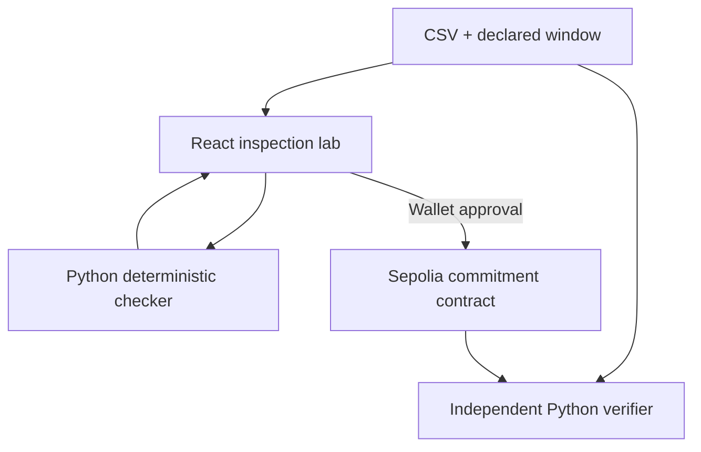

# GapWitness

### Witness the hours that were missing.

GapWitness checks the temporal integrity of an hourly environmental CSV. It compares the submitted timestamps with an independently declared observation window, exposes missing hours and invalid measurements, and lets a reviewer commit compact evidence on Ethereum Sepolia.

A report can look complete after the inconvenient hours have been removed. A hash taken afterward preserves that edited file, but cannot show which expected hours disappeared. GapWitness makes the declared window and its missing observations part of the evidence.

[Open the lab](https://gapwitness-web.vercel.app) · [Checker health](https://gapwitness-checker.vercel.app/health) · [Contract explorer](https://sepolia.etherscan.io/address/0x81433d6bedf33b72defe0b90534dc16cc2b0bc57) · [Report an issue](https://github.com/Tajudeeen/gapwitness/issues/new)

## Contents

- [Who it serves](#who-it-serves)
- [What the lab includes](#what-the-lab-includes)
- [Evidence and verdicts](#evidence-and-verdicts)
- [Trust boundary](#trust-boundary)
- [Demo data and provenance](#demo-data-and-provenance)
- [Architecture](#architecture)
- [Run locally](#run-locally)
- [API reference](#api-reference)
- [Independent verification](#independent-verification)
- [Sepolia deployment and live proof](#sepolia-deployment-and-live-proof)
- [Tests and reproducibility](#tests-and-reproducibility)
- [Repository map](#repository-map)
- [Known limits and scope](#known-limits-and-scope)
- [Contributing and attribution](#contributing-and-attribution)

## Who it serves

| User | Task | Useful output |
| --- | --- | --- |
| Environmental data reviewer | Check a station file before accepting a report | Missing timestamps, completeness, physical-rule violations |
| Researcher or data publisher | Preserve the evidence behind a specific observation window | Exact-byte hashes and an independently reproducible result |
| Auditor or community analyst | Compare a later file with previously committed evidence | A commitment match or an explicit conflict |
| Hackathon reviewer | Reproduce a focused climate-data integrity demonstration | Frozen fixtures, source manifests, tests, transaction receipts |

The current lab focuses on hourly PM2.5 values in µg/m³. The selected track is Climate Data & Environmental Monitoring.

## What the lab includes

- A responsive inspection lab with a 2.6-second launch splash and navigation between source, inspection, commitment, and proof.
- CSV upload with a declared station and UTC observation window.
- A segmented observation chart that leaves missing intervals visible instead of connecting across them.
- An hourly timeline, missing-hour evidence, completeness, deterministic verdicts, and evidence hashes.
- A two-state browser demonstration comparing a gapped file with a complete file for the same window.
- An injected EVM wallet flow for Ethereum Sepolia, transaction explorer links, and an evidence receipt view.
- A resource footer with source attribution, documentation, independent verification links, last-known checker connectivity, and proof limits.

Inspection does not require a wallet. Commitment requests a wallet and requires test ETH for gas. The browser demo performs two checker requests and sends no transaction.

## Evidence and verdicts

The observation window is start-inclusive and end-exclusive: `[windowStart, windowEnd)`. Expected timestamps occur at exact UTC hourly boundaries.

| Verdict | Code | Meaning |
| --- | --- | --- |
| `INTACT` | 0 | Every expected hour is present and no configured hard rule is violated |
| `GAPPED` | 1 | At least one expected hour is absent |
| `IMPOSSIBLE` | 2 | An in-window PM2.5 value violates the non-negative rule |

`IMPOSSIBLE` takes priority when a file also has gaps. Missing timestamps remain in the response. `materialGap` is true when more than two hours are missing in total; it is not a claim about a contiguous gap or scientific significance.

### Input requirements

| Input | Requirement |
| --- | --- |
| File | Non-empty CSV, at most 1,000,000 bytes, with a `.csv` filename for API uploads |
| Columns | `timestamp` and `value` |
| Timestamp | Parseable, unique instant, exactly on a UTC hour, including subsecond precision |
| Value | Finite numeric measurement; negative PM2.5 produces `IMPOSSIBLE` |
| Window | Starts at or after the Unix epoch, both ends hour-aligned, end after start, maximum 744 hours |
| Observations | At least one valid observation inside the declared window |
| Station | Non-empty identifier; use at most 31 UTF-8 bytes for web and independent on-chain verification |

The API accepts station strings up to 128 characters, while the wallet/verifier encoding supports only 31 UTF-8 bytes. Use the stricter limit for anything you plan to commit.

Timestamps without an explicit timezone are currently interpreted as UTC. Include `Z` or a timezone offset to avoid ambiguity. Out-of-window rows are validated and included in the exact-byte series hash, but do not count toward completeness or in-window physical-rule violations.

### Hash definitions

| Field | Definition |
| --- | --- |
| `seriesHash` | Ethereum Keccak-256 of the exact submitted CSV bytes |
| `gapHash` | Keccak-256 of the sorted missing UTC timestamps joined by newline characters, with no trailing newline |
| `policyHash` | Keccak-256 of the versioned checker policy identifier |
| Commitment key | Keccak-256 of ABI-encoded `stationId`, `uint64 windowStart`, and `uint64 windowEnd` |

The PM2.5 policy identifier is `gapwitness/pm25/hourly/v1`. The API also supports `generic` temporal inspection with its own policy hash; the web lab uses PM2.5.

Wallet and verifier station IDs use UTF-8 text padded with zero bytes to 32 bytes. A different byte order, whitespace, line ending, or measurement formatting changes the exact-byte series hash even if the displayed values look the same.

### Commitment rules

For the same station and exact window:

- The first commitment stores the evidence, submitter, and block timestamp.
- An identical replay succeeds as a no-op, preserving the first submitter and timestamp and emitting no new `Committed` event.
- A changed gap hash reverts with `GapPaperedOver`.
- A changed series hash, policy hash, or verdict reverts with `CommitmentChanged`.
- A different station or window uses a different commitment key.

## Trust boundary

Temporal integrity does not establish sensor calibration, source honesty, scientific accuracy, or physical truth.

The Python checker computes the verdict. The Solidity contract stores the submitted hashes and verdict and enforces consistency for an occupied station/window key. It does not parse the CSV, recompute the hashes, or authenticate a checker response.

The contract is permissionless. The first writer can occupy a station/window key with arbitrary claims, and a station label does not establish ownership or source authority. A commitment is a timestamped submission to verify against the retained CSV, rather than a certified environmental record. There is no oracle signature or station-authorization registry.

No AI decides the verdict. Uploaded CSV bytes are transmitted to the configured checker. Only compact hashes, the verdict, and commitment metadata are stored on-chain. Retain the original file and declared window for independent verification.

## Demo data and provenance

### Frozen OpenAQ fixtures

| Property | Recorded value |
| --- | --- |
| Archive location | 2178, Del Norte |
| PM2.5 sensor | 3920 |
| Archive day | September 19, 2026 |
| Provider | AirNow |
| Recorded data license | US Public Domain |
| Acquisition date | October 5, 2026 UTC |
| UTC observation window | September 19 at 07:00 through September 20 at 07:00 |
| Source timestamp convention | `exclusive-time-ending` |

[data/source/openaq-demo.json](data/source/openaq-demo.json) records the exact archive URL, archive SHA-256, sensor, selected window, removed hours, and fixture hashes.

| Fixture | Construction | Expected result |
| --- | --- | --- |
| [File A](checker/demo/file_a.csv) | Seven rows removed from the frozen complete window, 15:00Z through 21:00Z | `GAPPED`, seven missing hours |
| [File B](checker/demo/file_b.csv) | Selected source-window rows with measurements preserved | `INTACT` |
| [File C](checker/demo/file_c_impossible.csv) | Deliberate impossible-measurement derivative | `IMPOSSIBLE` |

File A is an adversarial derivative. It does not demonstrate a naturally occurring gap in the upstream OpenAQ record. File C is a policy-test fixture, not an allegation about the source.

### Browser demo

The built-in two-state demo generates synthetic values locally and sends them to the real checker. It shares the default station/window labels with the fixtures but does not use the frozen OpenAQ CSV bytes. Its hashes therefore differ from the source fixtures.

Use the repository fixtures when reproducing source-backed evidence or the chain demo. Do not describe the synthetic browser demo as observed OpenAQ measurements.

### Rebuild the fixtures

Do not hand-edit frozen fixture files. The source pipeline is:

1. Discover a complete hourly sensor window with `scripts/discover_openaq_window.py`.
2. Download a selected archive day with `scripts/fetch_openaq_day.py`.
3. Select the complete window with `scripts/select_openaq_window.py`.
4. Derive the explicit missing-hour file with `scripts/derive_openaq_fixtures.py`.
5. Derive the impossible-measurement fixture with `scripts/derive_impossible_fixture.py`.

Run each script with `--help` for its exact arguments. Selection, sensor identity, source bytes, timestamps, and generated hashes must be recorded together. [Source notes](data/source/openaq.md) explain acquisition requirements.

## Architecture



| Layer | Stack | Responsibility |
| --- | --- | --- |
| Web | React 19, TypeScript, Vite, ethers v6 | Upload, visualization, evidence presentation, wallet interaction |
| Checker | Python, FastAPI, pandas, PyCryptodome | CSV validation, expected hours, verdicts, Keccak evidence |
| Contract | Solidity 0.8.24, Foundry | Immutable first-witness storage and conflict rejection |
| Verification | Python CLI and Ethereum JSON-RPC | Recompute evidence and compare on-chain fields |
| Hosting | Separate Vercel web/checker projects | Public browser client and HTTP checker |

## Run locally

Prerequisites: Python 3.12, Node.js 22 or newer, npm, and Foundry for contract work. Run commands from the repository root unless stated otherwise.

### 1. Start the checker

```bash
python -m venv .venv
source .venv/bin/activate
python -m pip install -r checker/requirements.txt
python -m uvicorn app.main:app --app-dir checker --host 127.0.0.1 --port 8000
```

On Windows PowerShell, activate with `.\.venv\Scripts\Activate.ps1` instead of the Bash activation command. Check `http://127.0.0.1:8000/health` and interactive API docs at `http://127.0.0.1:8000/docs`.

### 2. Start the web lab

In a second terminal:

```bash
cd web
npm ci
cp .env.example .env
```

For PowerShell, use `Copy-Item .env.example .env`. Set the local checker URL in `web/.env`:

```dotenv
VITE_CHECKER_URL=http://127.0.0.1:8000
VITE_CONTRACT=0x81433d6bedf33b72defe0b90534dc16cc2b0bc57
VITE_CONTRACT_DEPLOYMENT_BLOCK=11850947
```

```bash
npm run dev
```

Open `http://localhost:5173`. The checker defaults to allowing that browser origin. Use the exact same hostname in your browser as the configured origin.

### Configuration

| Variable | Service | Purpose |
| --- | --- | --- |
| `VITE_CHECKER_URL` | Web | Checker base URL, defaults to `http://localhost:8000` |
| `VITE_CONTRACT` | Web | Actual Sepolia deployment address; empty disables commitment |
| `VITE_CONTRACT_DEPLOYMENT_BLOCK` | Web | Start block for locating prior commitment events |
| `WEB_ORIGIN` | Checker | Single allowed browser origin, default `http://localhost:5173` |
| `INSPECT_RATE_LIMIT` | Checker | Per-client inspection allowance, default 30 |
| `INSPECT_RATE_WINDOW_SECONDS` | Checker | In-memory rate-limit window, default 60 seconds |
| `PRIVATE_KEY` | Deployment only | Deployer wallet key, kept in encrypted workflow secrets |
| `SEPOLIA_RPC_URL` | Deployment/verification | Ethereum Sepolia JSON-RPC endpoint |
| `ETHERSCAN_API_KEY` | Optional source verification | Explorer verification credential |

Vite variables are public build-time settings. Never place secrets in a `VITE_*` variable. Environment changes require a new web deployment.

Production uses `https://gapwitness-checker.vercel.app` for the API and `https://gapwitness-web.vercel.app` as the checker CORS origin. Browser access requires public endpoints without a hosting sign-in wall. CORS controls browser access, not API authentication.

## API reference

### `GET /health`

Returns HTTP 200 with `ok`, service name, and checker version. This is a service reachability check, not proof of source freshness or contract health.

### `POST /inspect`

Multipart form fields:

| Field | Type | Required |
| --- | --- | --- |
| `stationId` | Text | Yes |
| `windowStart` | ISO timestamp | Yes |
| `windowEnd` | ISO timestamp | Yes |
| `seriesType` | `pm25` or `generic` | Defaults to `pm25` |
| `csv` | CSV upload | Yes |

```bash
curl -X POST http://127.0.0.1:8000/inspect \
  -F stationId=2178 \
  -F windowStart=2026-09-19T07:00:00Z \
  -F windowEnd=2026-09-20T07:00:00Z \
  -F seriesType=pm25 \
  -F csv=@checker/demo/file_a.csv
```

A successful response contains station/window context, expected and observed hours, missing timestamps, impossible timestamps, verdict/code, three hashes, and a `chainCommitment` object with Unix-second window boundaries.

HTTP 422 indicates unusable input, including duplicate/off-hour timestamps, non-finite values, an oversized window, or no observations inside the window. These are inspection errors, not verdicts. HTTP 429 includes `Retry-After`. The web surfaces failures without manufacturing a local verdict and disables commitment when the checker is unavailable.

## Independent verification

### Recompute local evidence

```bash
python verify.py checker/demo/file_a.csv \
  --station-id 2178 \
  --window-start 2026-09-19T07:00:00Z \
  --window-end 2026-09-20T07:00:00Z
```

### Compare with a committed record

```bash
python scripts/verify_onchain.py checker/demo/file_a.csv \
  --station-id 2178 \
  --window-start 2026-09-19T07:00:00Z \
  --window-end 2026-09-20T07:00:00Z \
  --contract 0x81433d6bedf33b72defe0b90534dc16cc2b0bc57 \
  --rpc-url https://ethereum-sepolia-rpc.publicnode.com
```

This verifier checks Sepolia chain identity, commitment existence, and matching series, gap, policy, and verdict fields. It emits JSON and exits 0 only on a complete match. It does not trust the browser.

The CSV must already have been committed for that exact station/window. Deploying a contract or running the synthetic replay regression does not commit File A. A missing record correctly produces a failed verification.

### Generate a fixture proof report

```bash
python scripts/build_demo_proof.py \
  --contract 0x81433d6bedf33b72defe0b90534dc16cc2b0bc57 \
  --deployment-tx 0xe073807470287af98f97f903a54da5d13edf51cbeaad987c13e314c62f0c018d \
  --deployment-block 11850947 \
  --output /tmp/gapwitness-demo-proof.json
```

This report recomputes fixture evidence and records supplied deployment metadata. It does not itself broadcast transactions or prove that the frozen fixtures are committed.

## Sepolia deployment and live proof

### Corrected deployment

| Field | Value |
| --- | --- |
| Chain | Ethereum Sepolia, `11155111` |
| Contract | [`0x81433d6bedf33b72defe0b90534dc16cc2b0bc57`](https://sepolia.etherscan.io/address/0x81433d6bedf33b72defe0b90534dc16cc2b0bc57) |
| Deployment transaction | [`0xe073807470287af98f97f903a54da5d13edf51cbeaad987c13e314c62f0c018d`](https://sepolia.etherscan.io/tx/0xe073807470287af98f97f903a54da5d13edf51cbeaad987c13e314c62f0c018d) |
| Deployment block | `11850947` |
| Source commit | `d93102c11f8076f73ab2bcbcfd039541ac36568b` |
| Deployment record | [contracts/deployments/sepolia.json](contracts/deployments/sepolia.json) |
| Explorer source verification | Not recorded as verified |

The earlier address `0xa7ab2d2e60a08a089f3749ac3e98b41449b23211` is historical and lacks the replay-provenance fix. It was not upgraded. Use the corrected address above.

### Mined replay evidence

[contracts/deployments/replay-proof.json](contracts/deployments/replay-proof.json) contains the commitment key, original storage, storage after replay, and both mined receipts.

- [First submission](https://sepolia.etherscan.io/tx/0x8cfb9fd4af3716ffc680363efdd5c9ce522b1c375e3f6e5b81220559369a0cd9) created the witness.
- [Exact replay](https://sepolia.etherscan.io/tx/0x85803de16c1e8a0b8c580d4b2c07e6a3feca25d9ca0c02dad939bcb7b0881ad8) succeeded in the next block, preserved every stored field, and emitted no event.

This is synthetic contract-regression evidence. It is distinct from the environmental fixture demo.

### Deployment workflows

The owner-only `/deploy-sepolia` issue-comment workflow runs contract tests, dry-runs, broadcasts, records deployment metadata, submits the live replay proof, uploads the proof artifact, and publishes a deployment-record branch. Review and integrate the new address/block before configuring the web.

The separate `deploy-sepolia` workflow supports manual dispatch and optional Etherscan source verification through the `sepolia` environment. It does not automatically run the replay proof.

Both routes need a funded testnet deployer and protected credentials. A deployment creates a new contract and does not migrate earlier commitments.

## Tests and reproducibility

### Checker and source pipeline

```bash
cd checker
python -m pytest -q
python ../scripts/test_prepare_chain_demo.py
python demo/run_demo.py
```

### Contract

```bash
cd contracts
forge install https://github.com/foundry-rs/forge-std --no-git
forge build
forge test -vv
```

Replay tests assert that a different wallet and later timestamp cannot overwrite the first witness and that no duplicate evidence event is emitted. Fuzz tests vary callers and replay timing. The regressions fail against the earlier implementation.

### Web

```bash
cd web
npm ci
npm run build
```

GitHub Actions cover the checker, source processing, contract, web build, deployment-record parsing, and deterministic fixture proof. The frozen OpenAQ fixture demo must remain reproducible from its manifests.

For the adversarial chain rehearsal, `scripts/prepare_chain_demo.py --contract <ADDRESS>` generates the frozen fixture inputs, and `contracts/script/DemoGapPaperOver.s.sol` attempts File A followed by conflicting File B. This is a separate broadcast operation requiring test ETH.

## Repository map

| Path | Contents |
| --- | --- |
| `web/src/App.tsx` | Inspection lab, chart, two-state demo, evidence receipt |
| `web/src/components/Footer.tsx` | Navigation, verification resources, attribution, connectivity display |
| `web/src/lib/checker.ts` | Checker HTTP client and response types |
| `web/src/lib/wallet.ts` | Wallet connection, station encoding, commitment and explorer helpers |
| `checker/app/main.py` | Deterministic inspection and FastAPI endpoints |
| `checker/demo/` | Frozen environmental fixtures and local demonstration |
| `checker/tests/` | Inspection, API, source-pipeline, and verification regressions |
| `contracts/src/GapWitness.sol` | Commitment registry |
| `contracts/test/` | Contract behavior and fuzz tests |
| `contracts/script/` | Deployment and adversarial chain rehearsal |
| `contracts/deployments/` | Public deployment metadata and replay receipts |
| `data/source/` | Archive provenance, source conventions, fixture hashes |
| `scripts/` | Source processing, deployment records, proof and verification tools |
| `.github/workflows/` | Builds, checks, source freezing, and deployment workflows |

## Known limits and scope

- One hourly environmental series per inspection, with a PM2.5-focused web experience.
- No authenticated station ownership or signed checker attestation on-chain.
- No sensor hardware, calibration checks, live ingestion, token, marketplace, or multi-chain support.
- The in-memory rate limiter is per process and resets when a process restarts; it is not a distributed abuse-control system.
- Footer connectivity reflects the last application health/inspection result, not continuous monitoring.
- The browser CSV chart parser is simpler than the server CSV parser. The server verdict and hashes are the evidence authority for an inspection.
- The printable receipt view is an on-screen representation, not an automatic PDF export.
- Explorer source verification remains separate from deployment and replay proof.
- A completed demo video is not included in the repository.

The delivery scope is a page, a checker, a contract, reproducible files, independent verification, and a focused demo video. Keep new work tied to that evidence flow.

## Contributing and attribution

Open an issue with the affected file/window, steps to reproduce, expected result, and actual result. Include public transaction hashes when relevant. Never include wallet keys, populated environment files, or private data.

For changes, preserve frozen fixture provenance, update this README, run the relevant checks, and use a reviewable branch. Do not introduce mocked on-chain success or describe generated demo data as observed measurements.

GapWitness is built by [Deeen_Codes](https://github.com/Tajudeeen). Frozen source attribution belongs to OpenAQ and its recorded provider, AirNow. These references do not imply partnership or endorsement.

No repository-wide software license is currently included. The source-data license in a manifest applies to those recorded data, not automatically to the application code.
